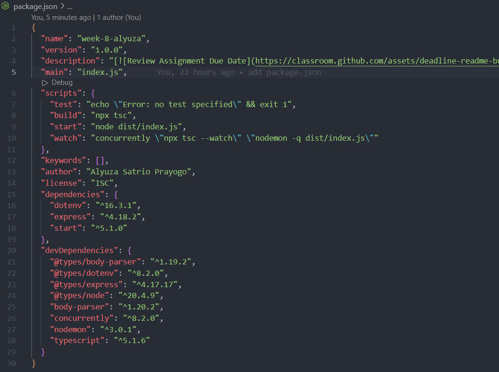
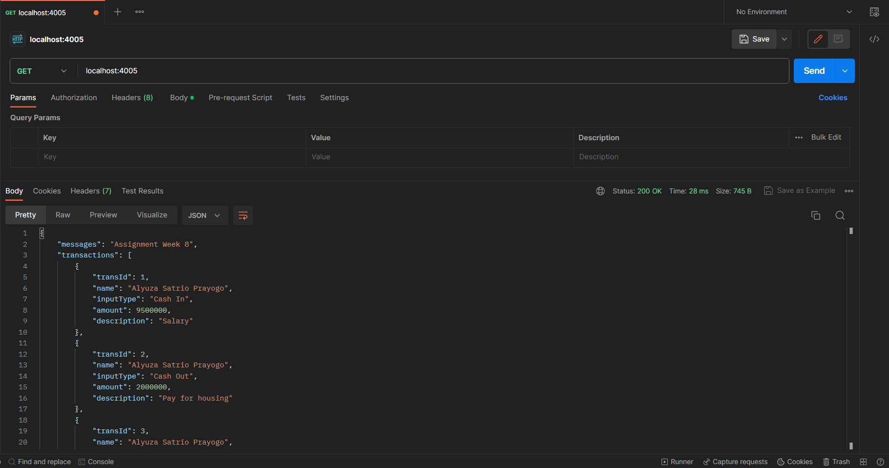
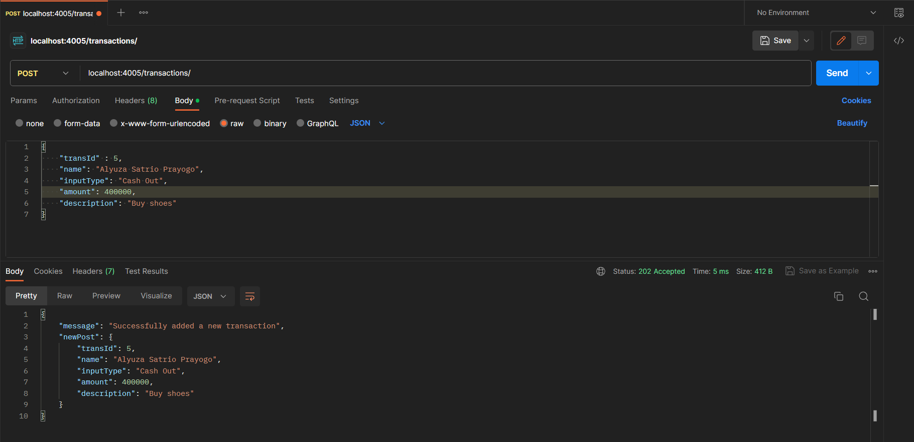
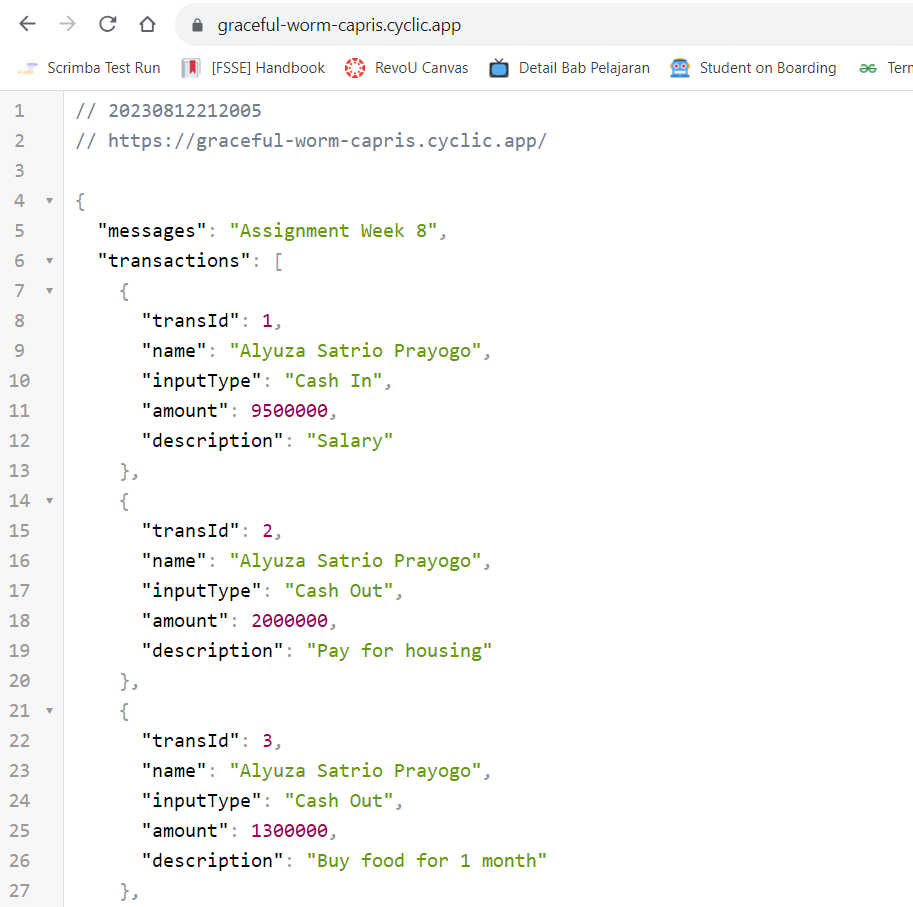

<!--  -->

# Simple REST API Server
Hello, I'm Yuza, in this assignment I created a simple REST API Server for Financial Tracker. Here I had trouble with deployment, but it worked in the end. Thanks for helping me Jitsi friends.

## Deployment 
Deployment link here [https://graceful-worm-capris.cyclic.app/](https://graceful-worm-capris.cyclic.app/)

## Tools
* Postman : provides JavaScript APIs that you can use in your request scripts.
* Typescript / JavaScript / ExpressJs
* Cyclic : Hosting

## Package.json

## Postman Testing

## Hosting

